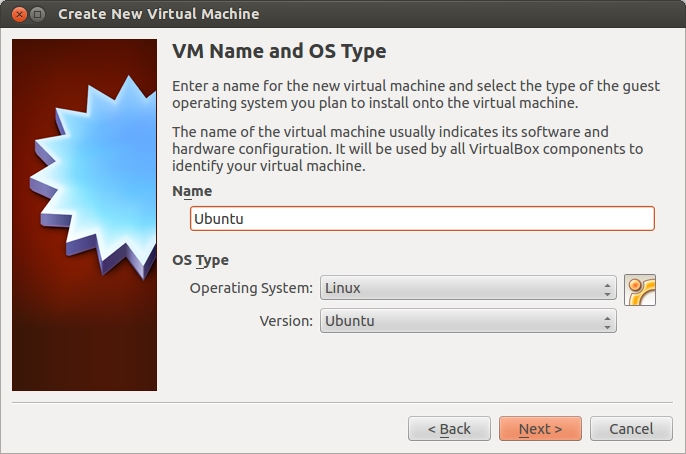

# Learning Objectives

In this lab, you will set up the development environment that the rest of the course depends on. By the end of this session, you will be able to:

- Install Ubuntu Linux in a virtual machine and configure it for productive use
- Install the system libraries required to build Geant4 with Qt visualization support
- Compile Geant4 from source using CMake
- Configure shell environment variables so applications can locate the Geant4 installation
- Verify the installation by inspecting the directory layout and environment

# Introduction

In this lab, you will install a Linux operating system in a virtual machine and build Geant4 from source with Qt (visualization) support. Geant4 is a toolkit for simulating ionizing particle interactions with matter — the foundation we will use throughout the rest of the lab series to model detectors, beams, and medical imaging systems.

# Prerequisites

- Computer with virtualization support enabled in BIOS/UEFI
- VirtualBox or VMware
- [Ubuntu 24 ISO Image](https://releases.ubuntu.com/noble/)
- Internet connection
- At least 50 GB of free disk space and 8 GB of RAM available to the VM

# Pre-Lab Questions

1. What is a virtual machine, and why are we using one for this course rather than installing Linux on the host machine directly?
2. What is the difference between a *source* distribution of a software package and a *binary* (pre-compiled) distribution?
3. What does CMake do? Why do we configure a build with CMake before running `make`?
4. What is an environment variable, and why does Geant4 ship a script (`geant4.sh`) for setting them?

# Step 1: Setting Up the Virtual Machine



1. Open VirtualBox or VMware.
2. Click "New" to create a virtual machine.
3. Name your virtual machine and select Linux type/version (Ubuntu).
   - Do not use the default VM location (create a new accessible folder instead).
4. Copy the ISO file into your chosen accessible folder (e.g., Downloads).
5. Select the ISO image file when prompted by VirtualBox.
6. Allocate memory (RAM): at least 8 GB.
7. Allocate CPU cores (maximum 60% of available cores). Check core count in Windows via `Settings > About Your PC`.
8. Create a virtual hard disk (at least 50 GB recommended).
9. Start the virtual machine and boot from the ISO.
10. Select "Try or Install Ubuntu" to launch the live session. This boots Ubuntu into a live session, allowing you to test it without affecting the virtual disk.
11. From the Linux desktop, click "Install Ubuntu" and follow installation prompts to create a permanent installation.
12. After installation, remove the ISO:
   - Go to the top menu bar and select `Devices > Optical Drives > Remove disk`. (Note: if its greyed out, then it has already been removed automatically).
   - Restart the virtual machine.
13. Log in to your new Ubuntu installation and switch to X11 session at the login screen (click the gear icon).

# Step 2: Enable Shared Clipboard and Fullscreen (Optional)

1. Open Terminal in Linux (`Ctrl+Alt+T`). Update and install essential packages:

   ```bash
   sudo apt update && sudo apt install -y build-essential \
     dkms linux-headers-$(uname -r) bzip2 tar
   ```

2. Insert Guest Additions CD via `Devices > Insert Guest Additions CD image`

   Mount the CD with the following command:
   
   ```bash
   sudo mount /dev/cdrom /mnt
   ```
   
   Navigate to that folder with cd (change directory):
   
   ```bash
   cd /mnt
   ```
   
   Run:
   
   ```bash
   sudo ./VBoxLinuxAdditions.run
   ```

3. Enable fullscreen with `Right Ctrl + F`.
4. Enable Shared Clipboard which allows you to paste commands into the terminal:
   - In VirtualBox, go to `Settings > Advanced` and set Shared Clipboard to "Bidirectional".
   - Restart the VM.

# Step 3: Install Required Packages

Run the following to install the libraries needed to build Geant4 with Qt support:

```bash
sudo apt-get install build-essential libexpat1-dev \
  libxmu-dev cmake cmake-curses-gui qtbase5-dev qt5-qmake
```

# Step 4: Building Geant4 with Qt and Data


1. Download Geant4 source code (tar.gz) from https://geant4.web.cern.ch/download/11.3.2.html.
2. Extract and move the folder (`geant4-v11.3.2`) to your home directory.

3. Create a build folder:

   ```bash
   mkdir -p ~/geant4build
   cd ~/geant4build
   ```

4. Configure Geant4 with CMake:

   ```bash
   cmake \
     -DCMAKE_INSTALL_PREFIX=/usr/local \
     -DGEANT4_INSTALL_DATA=ON \
     -DGEANT4_INSTALL_DATADIR=/usr/local/share/Geant4/data \
     -DGEANT4_USE_QT=ON \
     ~/geant4-v11.3.2
   ```

5. Compile using all available processors:

   ```bash
   make -j$(nproc)
   ```

6. Install Geant4:

   ```bash
   sudo make install
   ```

# Step 5: Post-Installation Setup

1. Configure library paths:

   ```bash
   echo "/usr/local/lib" | sudo tee \
     /etc/ld.so.conf.d/geant4.conf
   sudo ldconfig
   ```

2. Set environment variables for Geant4. The Geant4 installer ships a shell script that exports `G4INSTALL`, `G4LEDATA`, and the other variables Geant4 applications need at runtime:

   ```bash
   source /usr/local/bin/geant4.sh
   ```

   You will need to source this script in every new terminal where you build or run Geant4 code. (You can add `source /usr/local/bin/geant4.sh` to your `~/.bashrc` to make it automatic.)

## Verification and Analysis

1. Verify that the environment is set correctly. In the same terminal where you sourced `geant4.sh`, run:

   ```bash
   env | grep G4
   ```

   You should see several lines of output that start with `G4...` — for example `G4INSTALL=/usr/local`, `G4LEDATAPATH=...`, and so on. This confirms the environment variables were exported.

   If `G4INSTALL` is unset, the `source` step did not run successfully; re-run it before continuing.

2. Navigate to your installation directory and explore the structure:

   ```bash
   cd /usr/local
   ls -R | less
   ```

   Can you find:
   - The `lib` directory containing the libraries?
   - The `include` directory with header files?
   - The `share` directory with examples and data files?

## Troubleshooting

- If CMake fails, check that all required packages are installed
- If compilation fails with memory errors, reduce the number of parallel jobs (e.g., `make -j2` instead of `make -j$(nproc)`)
- If environment variables are not set, ensure you have sourced `geant4.sh` in your current terminal

## Verification Checklist

Before completing this lab, verify you can:

- [ ] Boot a working Ubuntu virtual machine with shared clipboard and fullscreen support
- [ ] Install build dependencies and Qt5 development packages from `apt`
- [ ] Run CMake to configure the Geant4 build with Qt and data downloads enabled
- [ ] Compile and install Geant4 with `make` and `sudo make install`
- [ ] Source `geant4.sh` and confirm `G4INSTALL` and related variables are set
- [ ] Locate the Geant4 examples directory under `/usr/local/share`

## Conclusion

You have successfully set up a Linux virtual machine and compiled Geant4 from source with Qt visualization support. In Lab 2 you will use this environment to build and run your first particle-physics simulation.
