## Learning Objectives

In this lab, you will compile and run your first Geant4 simulation. You will learn the difference between interactive and batch mode and how to control the simulation parameters. By the end of this session, you will be able to:

- Locate and copy Geant4 example applications from the source distribution
- Compile a Geant4 example application using CMake
- Run a simulation and visualize the results in a graphical user interface (GUI)
- Use the Geant4 command-line interface to control the simulation
- Create and use macro files to run simulations in batch mode
- Modify simulation parameters, such as particle type, energy, and the number of events

## Introduction

Now that you have a working Geant4 installation, it's time to use it. Geant4 is a toolkit, which means we use it to build our own specific applications. The Geant4 distribution includes many examples that demonstrate how to do this. We will start with **Example B1**, a simple application that simulates a particle beam hitting a target made of different materials and measures the energy deposited.

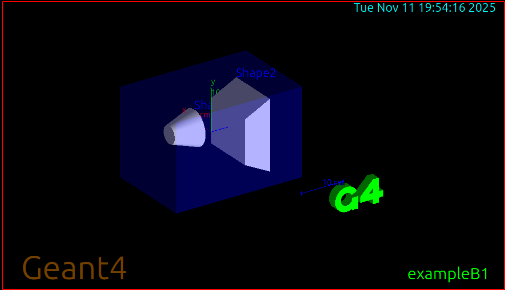

You will learn to run this application in two ways:

1. **Interactive Mode:** This mode opens a GUI, allowing you to see the detector geometry and particle tracks. It's excellent for debugging and understanding the simulation visually.
2. **Batch Mode:** This mode runs without a GUI, executing a series of commands from a text file called a "macro". This is how you run simulations to collect large amounts of data for analysis.

Mastering both modes is key to the scientific computing workflow: explore and debug visually, then collect data efficiently.

## Prerequisites

Before you begin, ensure you have the following:

- Completed Lab 1 (Geant4 installed and environment configured)
- Geant4 source code available on your system
- CMake and C++ compiler (already installed in Lab 1)
- Qt5 support enabled (for GUI visualization)

## Pre-Lab Questions

1. In the context of a simulation, what is an "event"? What is a "run"?
2. What is the purpose of a macro file in Geant4?
3. Based on the Example B1 README, what is the default particle and energy being simulated?
4. What is the difference between compiling Geant4 itself and compiling a Geant4 application?

## Step 1: Locate and Copy Example B1

The Example B1 source code (and all other examples) are included in the Geant4 source code that you downloaded in Lab 1.

1. First, verify where your Geant4 source code is located. If you followed Lab 1, it should be in your home directory:

   ```bash
   ls ~/geant4-v11.3.2/examples/basic/B1
   ```

2. Create a dedicated directory for lab examples and navigate into it:

   ```bash
   mkdir -p ~/g4-labs/lab2
   cd ~/g4-labs/lab2
   ```

3. Copy the source code for Example B1 into your lab directory:

   ```bash
   cp -r ~/geant4-v11.3.2/examples/basic/B1 .
   ```

4. Navigate into the B1 example directory:

   ```bash
   cd B1
   ```

5. Explore the contents of the directory:

   ```bash
   ls -l
   ```

   You should see several directories and files:
   - `src/` - Source code files (.cc)
   - `include/` - Header files (.hh)
   - `exampleB1.cc` - Main program file
   - `CMakeLists.txt` - Build configuration
   - `*.mac` - Macro files for different run configurations
   - `README` - Documentation for this example

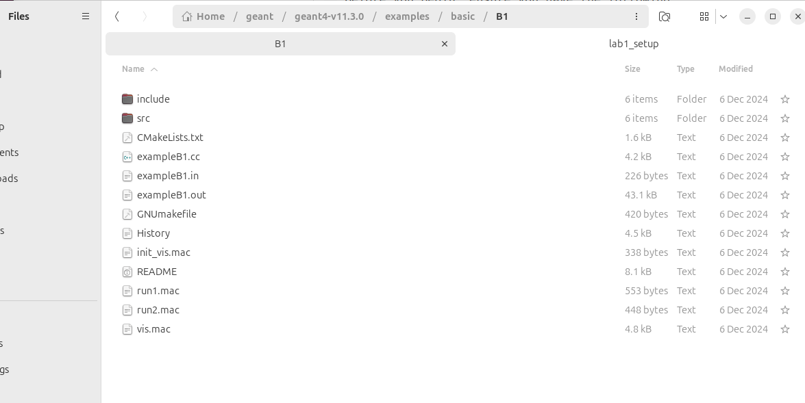

## Step 2: Compile the B1 Application

Just like we compiled Geant4 itself in Lab 1, we need to compile the B1 application. We will use the same out-of-source build technique with CMake.

1. First, ensure your Geant4 environment is set up. Open a new terminal and run:

   ```bash
   source /usr/local/bin/geant4.sh
   ```

   Verify the environment variables are set:

   ```bash
   env | grep G4
   ```

2. Create a build directory for the B1 application inside the B1 folder:

   ```bash
   mkdir build
   cd build
   ```

3. Run `cmake` to configure the build. The `..` tells `cmake` to look for the source code in the parent directory:

   ```bash
   cmake ..
   ```

   Because you sourced the `geant4.sh` script, `cmake` automatically knows where to find your Geant4 installation.

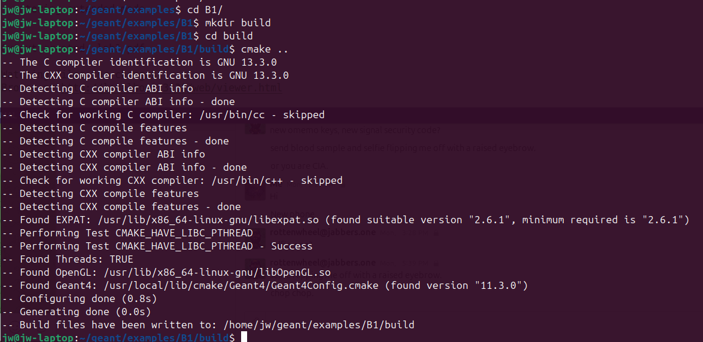

4. Compile the application using `make`:

   ```bash
   make -j$(nproc)
   ```

   This uses all available CPU cores to speed up compilation.

5. After compilation finishes, verify the executable was created:

   ```bash
   ls -lh exampleB1
   ```

   You should see the `exampleB1` executable file.

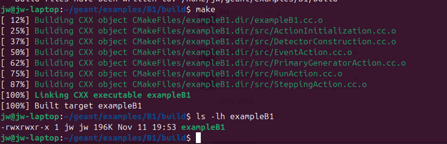

## Step 3: Run in Interactive Mode (GUI)

Now let's run the simulation with the graphical user interface to visualize what's happening.

1. From the `B1/build` directory, run the executable with no arguments:

   ```bash
   ./exampleB1
   ```

2. A Qt GUI window should appear showing:
   - Left pane: 3D viewer with the detector geometry
   - Right pane: Control panel with viewing options
   - Bottom pane: Command-line interface with `Idle>` prompt

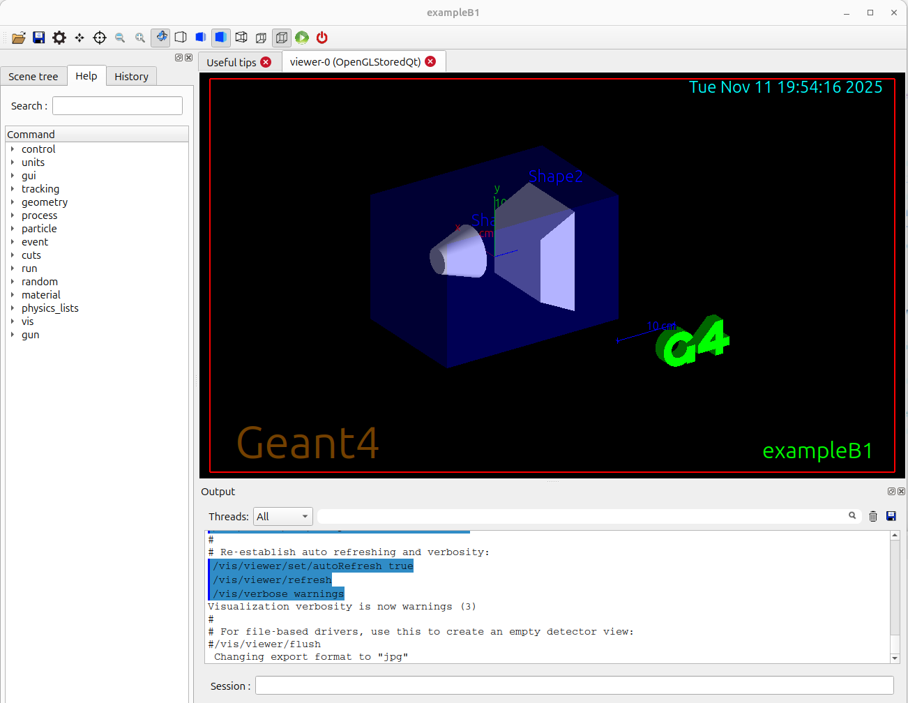

3. The simulation is now waiting for your commands. Let's fire 10 particles. At the `Idle>` prompt, type:

   ```bash
   /run/beamOn 10
   ```

4. You will see green lines appear in the detector. These are the tracks of the particles (6 MeV gamma rays by default) and their secondary particles as they travel through the water, tissue, and bone materials.

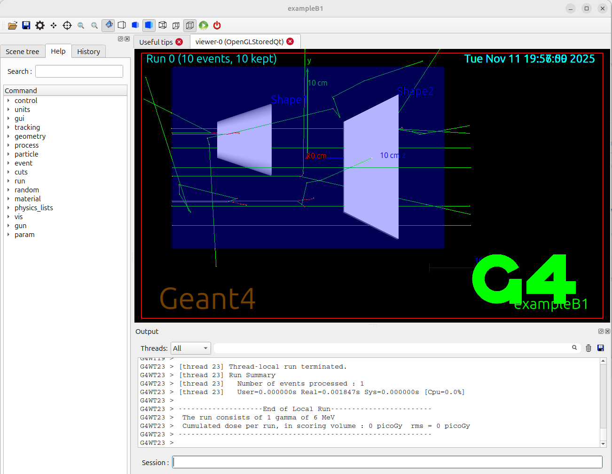

5. Experiment with the visualization:
   - Use your mouse to rotate the view (left-click and drag)
   - Zoom in/out (scroll wheel)
   - Pan the view (middle-click and drag, or shift + left-click)
   - Try different viewing angles to understand the geometry

6. Run more events to see different particle behaviors:

   ```bash
   /run/beamOn 50
   ```

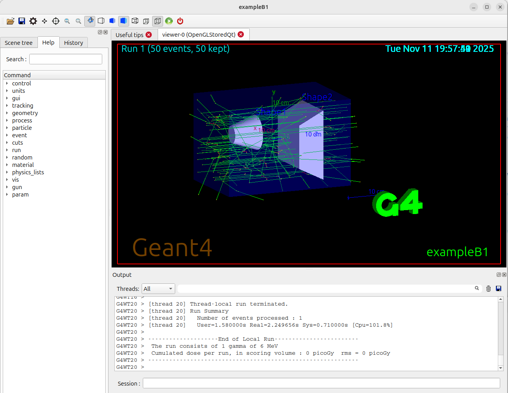

7. To exit the application, type `exit` at the prompt:

   ```bash
   exit
   ```

## Step 4: Understanding the Simulation Output

1. Look at the terminal output from your interactive run. You should see information including:
   - Run summary
   - Mean energy deposited in different volumes
   - Dose calculations

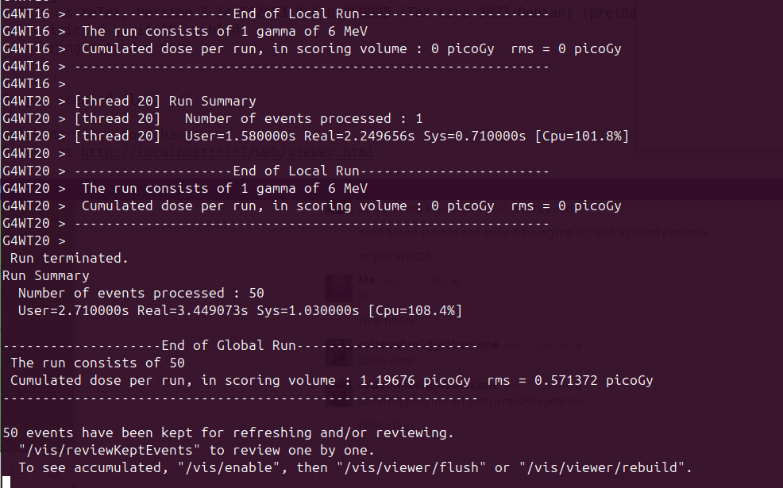

2. The output shows:
   - **Absorber**: Energy deposited in the main target material
   - **Gap**: Energy deposited in the gap regions
   - **Dose**: Radiation dose in the sensitive detector

## Step 5: Run in Batch Mode (Macros)

Running simulations by typing commands one by one is tedious. For longer runs and reproducible simulations, we use macro files.

1. Go back to the main `B1` directory (one level up from `build`):

   ```bash
   cd ..
   ```

2. View the contents of the provided macro file `run1.mac`:

   ```bash
   cat run1.mac
   ```

   You will see a list of Geant4 commands, including `/run/beamOn 10`.

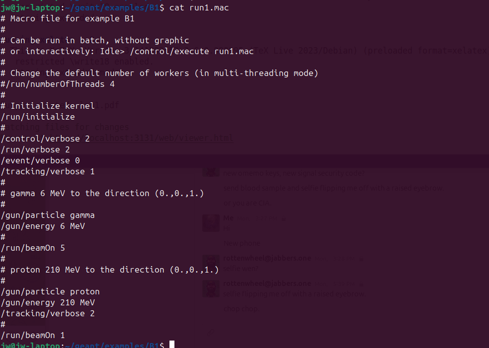

3. Now, run the simulation using the macro file:

   ```bash
   cd build
   ./exampleB1 ../run1.mac
   ```

4. The simulation will run immediately, printing information to the terminal, and then exit. You will see output summarizing the run, including the mean energy and dose deposited in the sensitive volumes. No GUI will appear—this is batch mode.

5. Let's examine another macro file that shows more options:

   ```bash
   cat ../exampleB1.in
   ```

   Notice the lines controlling the particle gun:
   - `/gun/particle gamma` - Sets particle type
   - `/gun/energy 6 MeV` - Sets particle energy

## Step 6: Modifying the Simulation

The real power of Geant4 is the ability to easily change simulation parameters using UI commands in macro files.

1. Create a new macro file for your custom simulation. In the `B1` directory (not `build`), create `mylab.mac`:

   ```bash
   cd ~/g4-labs/lab2/B1
   nano mylab.mac
   ```

   Or use your preferred text editor (gedit, vim, etc.)

2. Add the following commands to your macro file:

   ```
   # My custom run for Lab 2
   # Author: [Your Name]
   
   # Initialize the kernel
   /run/initialize
   
   # Set the particle to a proton
   /gun/particle proton
   
   # Set the proton's kinetic energy to 150 MeV
   /gun/energy 150 MeV
   
   # Print progress every 100 events
   /run/printProgress 100
   
   # Run 1000 events
   /run/beamOn 1000
   ```

3. Save and close the file.

4. Run the simulation using your new macro:

   ```bash
   cd build
   ./exampleB1 ../mylab.mac
   ```

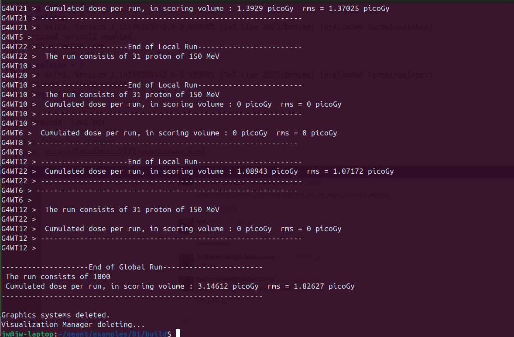

## Step 7: Exploring Different Particles and Energies

Let's create additional macro files to explore different simulation scenarios:

1. Create a macro for electron simulation (`electron_beam.mac`):

   ```
   /run/initialize
   /gun/particle e-
   /gun/energy 50 MeV
   /run/beamOn 500
   ```

2. Create a macro for neutron simulation (`neutron_beam.mac`):

   ```
   /run/initialize
   /gun/particle neutron
   /gun/energy 14 MeV
   /run/beamOn 1000
   ```

3. Run each simulation and compare the results:

   ```bash
   ./exampleB1 ../electron_beam.mac
   ./exampleB1 ../neutron_beam.mac
   ```

## Analysis Questions

1. Compare the output in your terminal from the default run (10 gammas) and your custom run (1000 protons).

2. Look at the final lines of the output for both runs. Find the section that says:
   `The run consists of... The mean energy deposited in the envelope is...`

3. How does the mean energy deposited per event differ between:
   - 6 MeV gamma rays
   - 150 MeV protons
   - 50 MeV electrons
   - 14 MeV neutrons

4. Does the result make sense intuitively? Why or why not? Consider:
   - Different interaction mechanisms for different particles
   - Energy of the incident particles
   - Range and stopping power

5. Why is batch mode more suitable for running 1000 events than interactive mode?

6. What advantages does using macro files provide for scientific reproducibility?

## Optional: Setting up VS Code IDE

For more advanced development work, you may want to use an Integrated Development Environment (IDE) like VS Code:

1. Download and install [VS Code](https://code.visualstudio.com/)

2. Install useful extensions:
   - C/C++ Extension Pack
   - CMake Tools
   - Code Runner

3. Open the B1 directory in VS Code:

   ```bash
   code ~/g4-labs/lab2/B1
   ```

4. Explore the source code files to understand how the simulation works:
   - `exampleB1.cc` - Main program
   - `src/DetectorConstruction.cc` - Geometry definition
   - `src/PrimaryGeneratorAction.cc` - Particle gun setup
   - `src/RunAction.cc` - What happens each run
   - `src/EventAction.cc` - What happens each event

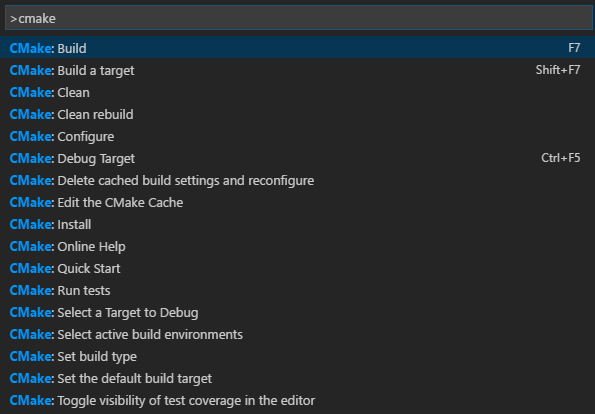

## Troubleshooting

- **Error: "Geant4 not found"**: Make sure you've sourced the `geant4.sh` script in your current terminal session
- **No GUI appears**: Verify that Qt5 was enabled when you built Geant4 (`GEANT4_USE_QT=ON`)
- **Compilation errors**: Ensure all Lab 1 dependencies are installed
- **Macro file not found**: Check that you're running from the `build` directory and using the correct relative path (`../mylab.mac`)

## Verification Checklist

Before completing this lab, verify you can:

- [ ] Locate and copy Geant4 example code
- [ ] Build a Geant4 application using CMake
- [ ] Run simulations in interactive mode with GUI
- [ ] Run simulations in batch mode using macro files
- [ ] Create custom macro files with different particles and energies
- [ ] Interpret the simulation output and energy deposition results

## Conclusion

You have successfully compiled and run your first Geant4 simulation using Example B1. You've learned to work in both interactive and batch modes, and you've seen how to modify simulation parameters using macro files. These skills form the foundation for all future Geant4 work, where you'll create increasingly complex simulations for radiation physics and detector design applications.

## References

- Geant4 Collaboration. (n.d.). *Book for Application Developers*
- Geant4 Collaboration. (n.d.). *README for examples/basic/B1*. GitLab
- Geant4 Example B1 Macro Files: `run1.mac`, `exampleB1.in`
- SLAC. (2021). *Geant4 Tutorial: Hands On 1*

## Additional Resources

- [Geant4 User's Guide for Application Developers](https://geant4-userdoc.web.cern.ch/UsersGuides/ForApplicationDeveloper/html/)
- [Geant4 Examples Documentation](https://geant4-userdoc.web.cern.ch/UsersGuides/ForApplicationDeveloper/html/Examples/examples.html)
- [Geant4 Command Reference](https://geant4-userdoc.web.cern.ch/UsersGuides/ForApplicationDeveloper/html/Control/AllResources/Control/UIcommands/html)

