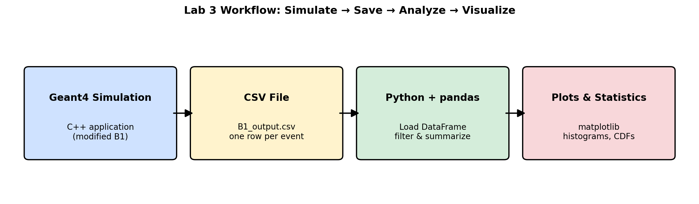
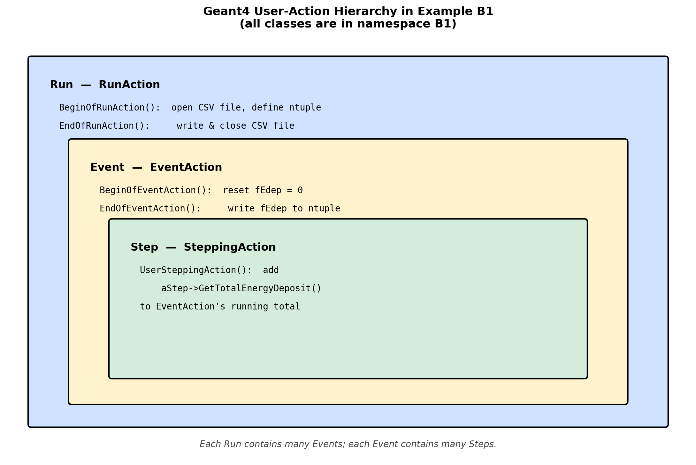
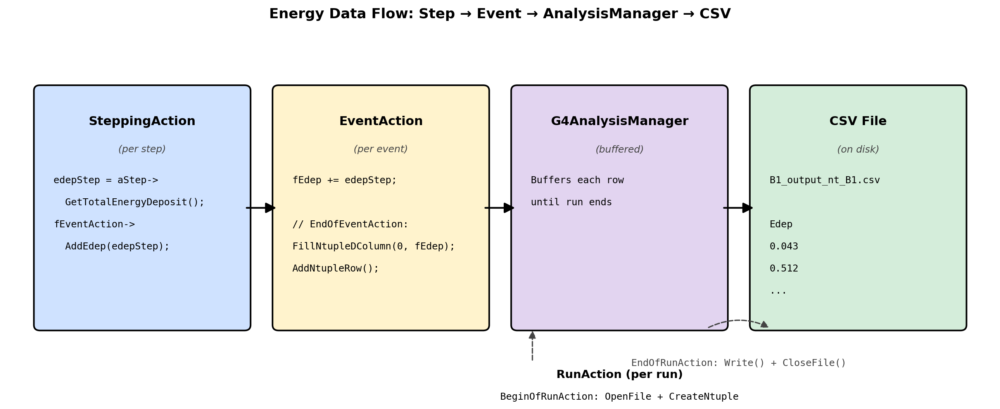
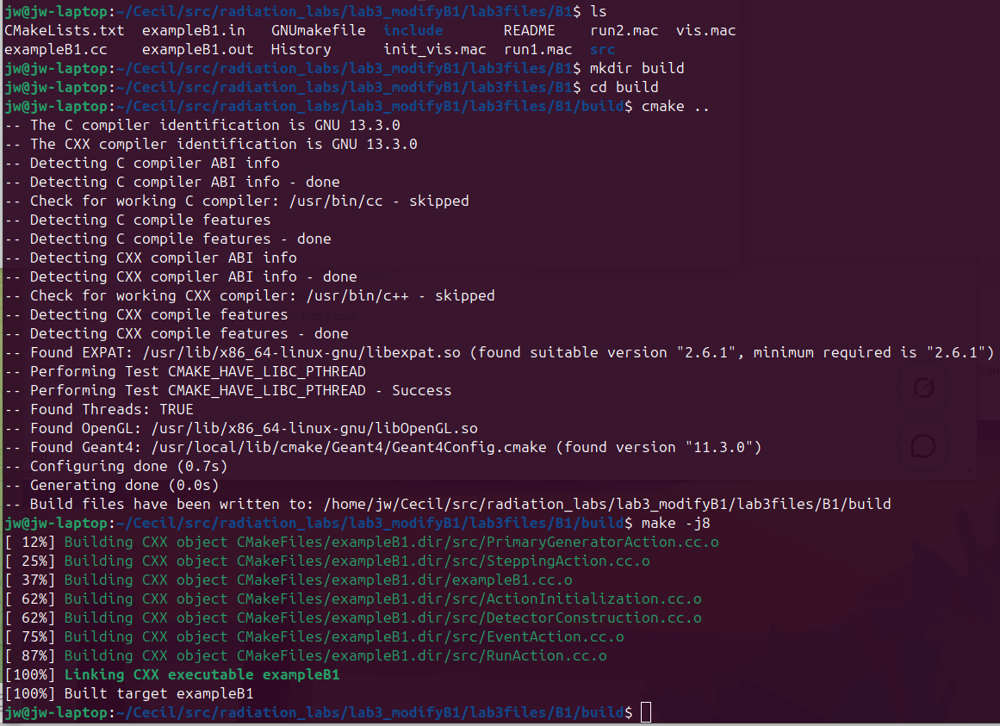
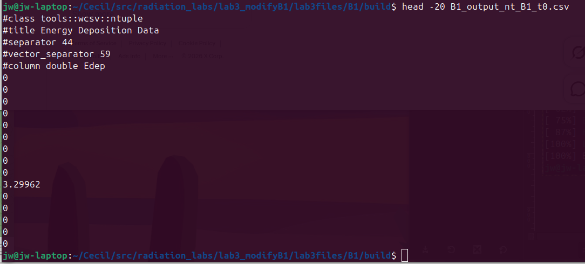
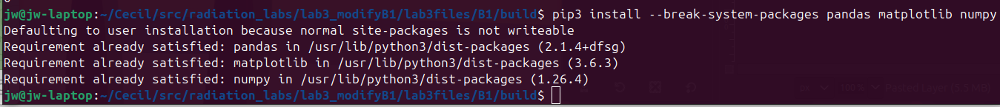
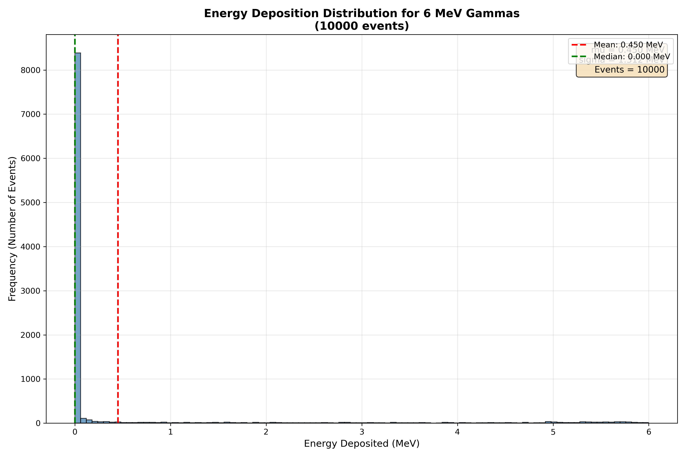
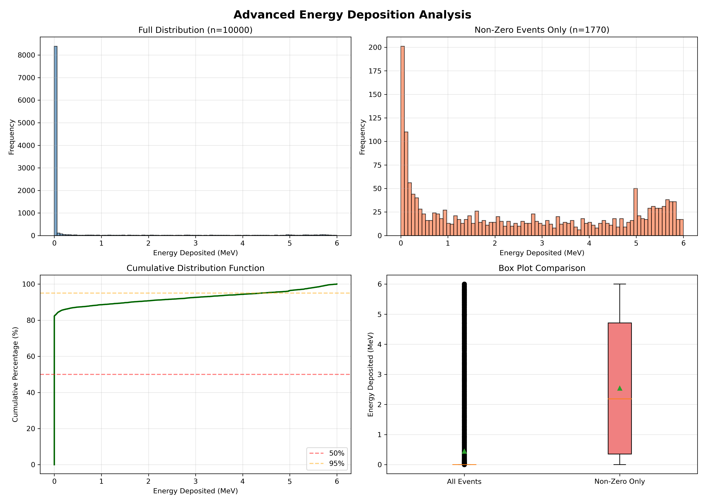
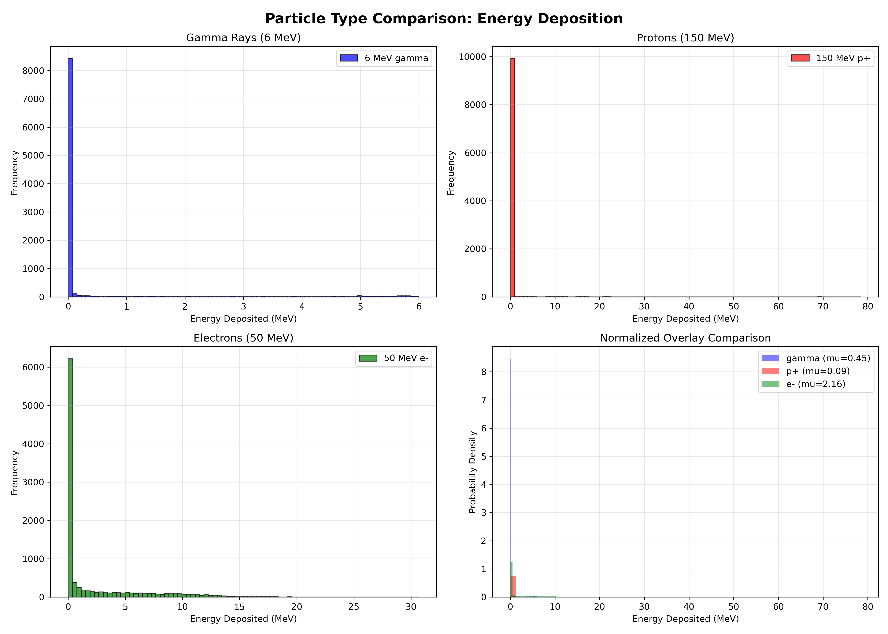

## Learning Objectives

In this lab, you will bridge the gap between simulation and analysis. You will modify the C++ source code of a Geant4 application to save data and then use Python to analyze and visualize that data. By the end of this session, you will be able to:

- Understand the basic structure of Geant4 user action classes
- Modify C++ code to implement the `G4AnalysisManager` for data output
- Save simulation results to CSV file format for universal compatibility
- Write Python scripts using the `pandas` and `matplotlib` libraries
- Load simulation data into pandas DataFrames
- Create and customize histograms to visualize distributions
- Calculate descriptive statistics (mean, standard deviation, percentiles) from data
- Filter and manipulate data using pandas operations
- Compare multiple datasets and create multi-plot figures

## Introduction

A simulation that produces no output is not very useful. To perform scientific analysis, we need to "score" quantities of interest—like the energy deposited in a detector—and save this data to a file. In this lab, you will learn the modern, standard way to do this in Geant4 using a special class called `G4AnalysisManager`. We will configure it to save the energy deposited in each event into a simple text-based CSV (Comma-Separated Values) file.



Once we have the data, we will switch hats from a simulation user to a data analyst. We will use the powerful Python programming language along with two essential libraries: `pandas` for data manipulation and `matplotlib` for plotting. You will write a script to read the CSV file and generate a histogram, which is a graph that shows the frequency distribution of the energy deposition values. This process—simulate, save, analyze, visualize—is a fundamental cycle in computational science.

## Prerequisites

Before you begin, ensure you have the following:

- Completed Lab 2 (successfully built and ran Example B1)
- Text editor for C++ code (gedit, nano, or VS Code)
- Basic understanding of C++ syntax (we'll guide you through the modifications)
- Python 3 installed (should be pre-installed on Ubuntu)

## Pre-Lab Questions

1. What is a CSV file? Why is it a good choice for this lab compared to a more complex format like ROOT?
2. What is a histogram and what does it show?
3. Briefly describe the roles of the `pandas` and `matplotlib` Python libraries.
4. In Geant4, what is the difference between a "Run", an "Event", and a "Step"?
5. What does it mean to "score" a quantity in a simulation?

## Step 1: Set Up the Lab and Review the Code Structure

1. Create a new directory for this lab and copy the B1 example into it, just as you did in Lab 2:

   ```bash
   mkdir -p ~/g4-labs/lab3
   cd ~/g4-labs/lab3
   cp -r ~/geant4-v11.3.2/examples/basic/B1 .
   cd B1
   ```

2. Before we start modifying, let's understand the key files and the Geant4 action hierarchy:

   

   In the modern B1 example, all of these classes live inside `namespace B1 { ... }`. The header and source files do **not** carry a `B1` filename prefix — for example, the run-action class is declared as `class RunAction` inside `namespace B1`, in `include/RunAction.hh`. Every code addition you make in this lab will go inside an existing `namespace B1` block in the corresponding `.cc` file.

   Familiarize yourself with these key files:

   - **`include/RunAction.hh`** & **`src/RunAction.cc`**:
     - Controls actions at the beginning and end of a **Run** (a collection of events)
     - We will edit the source file to open, write, and close the CSV output

   - **`include/EventAction.hh`** & **`src/EventAction.cc`**:
     - Controls actions at the beginning and end of each **Event** (simulation of one primary particle)
     - We will edit the source file to record one row of CSV data per event

   - **`src/SteppingAction.cc`**:
     - Executed at every single **Step** a particle takes through the geometry
     - The example already collects per-step energy here. We will **not** modify this file.

3. Open `src/SteppingAction.cc` in a text editor and read through `UserSteppingAction`:

   ```bash
   gedit src/SteppingAction.cc &
   ```

   Notice that the example already extracts each step's energy deposit and adds it to the event total via `fEventAction->AddEdep(edepStep)`. The data lives in memory but never reaches disk — fixing that is what this lab is about.

## Step 2: Modify C++ Code to Save Data

### What the example already does

Before we add anything, look at how energy already flows through the unmodified B1 example. Open these three files in your editor and find the lines below — you do **not** need to change them:

- `include/EventAction.hh` already declares the helper and the per-event accumulator:

  ```cpp
  void AddEdep(G4double edep) { fEdep += edep; }
  G4double fEdep = 0.;
  ```

- `src/EventAction.cc` already resets `fEdep` at the start of each event and forwards it to the run action at the end:

  ```cpp
  void EventAction::BeginOfEventAction(const G4Event*)  { fEdep = 0.; }
  void EventAction::EndOfEventAction(const G4Event*)   { fRunAction->AddEdep(fEdep); }
  ```

- `src/SteppingAction.cc` already accumulates each step's deposit into the event total:

  ```cpp
  G4double edepStep = step->GetTotalEnergyDeposit();
  fEventAction->AddEdep(edepStep);
  ```

So the per-step → per-event → per-run pipeline is **already wired up**. The energy lands in `fEdep` at the end of each event. Our only job in this lab is to also write that value to a CSV file.

### What we'll change

There are exactly two files to edit:

1. **`src/RunAction.cc`** — set up the CSV file at the start of the run and write/close it at the end.
2. **`src/EventAction.cc`** — at the end of each event, write `fEdep` as one new row of the CSV.

That's it. Two `#include` additions and ~12 new lines of code in total.



### Modification 1: RunAction.cc

We use `G4AnalysisManager`, Geant4's built-in writer that supports CSV, ROOT, XML, and HDF5. We'll use CSV.

1. Open `src/RunAction.cc`:

   ```bash
   gedit src/RunAction.cc &
   ```

2. Add the analysis-manager header near the other `#include` lines at the top:

   ```cpp
   #include "G4AnalysisManager.hh"
   ```

3. Inside `RunAction::BeginOfRunAction(const G4Run*)`, add the following block (anywhere inside the function body is fine — putting it at the top is conventional):

   ```cpp
   // --- Lab 3 addition: open CSV and define the per-event ntuple ---
   auto analysisManager = G4AnalysisManager::Instance();
   analysisManager->SetDefaultFileType("csv");
   analysisManager->OpenFile("B1_output");

   analysisManager->CreateNtuple("B1", "Energy Deposition Data");
   analysisManager->CreateNtupleDColumn("Edep");  // column 0
   analysisManager->FinishNtuple();
   ```

   **What this does:** Tells the analysis manager to write CSV, gives the file a name (`B1_output`), and declares one ntuple column called `Edep`. Each row will hold one event's `fEdep`.

4. Inside `RunAction::EndOfRunAction(const G4Run* run)`, add the following at the **very end** of the function (after the existing `G4cout` print block):

   ```cpp
   // --- Lab 3 addition: flush and close the CSV ---
   auto analysisManager = G4AnalysisManager::Instance();
   analysisManager->Write();
   analysisManager->CloseFile();
   ```

### Modification 2: EventAction.cc

1. Open `src/EventAction.cc`:

   ```bash
   gedit src/EventAction.cc &
   ```

2. Add the analysis-manager header near the top:

   ```cpp
   #include "G4AnalysisManager.hh"
   ```

3. Find the existing `EventAction::EndOfEventAction` function. It currently looks like this — **do not retype it**, you are only locating it:

   ```cpp
   void EventAction::EndOfEventAction(const G4Event*)
   {
     // accumulate statistics in run action
     fRunAction->AddEdep(fEdep);
   }
   ```

   **Inside** that function, *after* the existing `fRunAction->AddEdep(fEdep);` line and *before* the closing `}`, paste these four lines (and only these four lines):

   ```cpp
   // --- Lab 3 addition: also write fEdep to the CSV ---
   auto analysisManager = G4AnalysisManager::Instance();
   analysisManager->FillNtupleDColumn(0, fEdep);
   analysisManager->AddNtupleRow();
   ```

   After your edit, the complete function should read:

   ```cpp
   void EventAction::EndOfEventAction(const G4Event*)
   {
     // accumulate statistics in run action
     fRunAction->AddEdep(fEdep);

     // --- Lab 3 addition: also write fEdep to the CSV ---
     auto analysisManager = G4AnalysisManager::Instance();
     analysisManager->FillNtupleDColumn(0, fEdep);
     analysisManager->AddNtupleRow();
   }
   ```

   **What this does:** Each event ends with one new row in the CSV containing the total energy deposited in the scoring volume during that event.

### Summary of Modifications

You've now modified two files:

| File | Change |
|------|--------|
| `src/RunAction.cc` | Add `G4AnalysisManager.hh`; open the CSV in `BeginOfRunAction`, write/close it in `EndOfRunAction` |
| `src/EventAction.cc` | Add `G4AnalysisManager.hh`; in `EndOfEventAction`, fill one ntuple row per event |

Note that `EventAction.hh`, `SteppingAction.cc`, and the energy-accumulation logic itself were left untouched — the example already had everything we needed up to the point of writing to disk.

## Step 3: Compile and Run the Modified Application

Now let's compile your modified code and generate some data!

1. Navigate to the build directory (create one if it doesn't exist):

   ```bash
   mkdir -p build
   cd build
   ```

2. Configure the build with CMake:

   ```bash
   cmake ..
   ```

3. Compile the modified application:

   ```bash
   make -j$(nproc)
   ```

   If you encounter errors, carefully check your code modifications against the instructions. Common issues:
   - Missing semicolons
   - Incorrect placement of code
   - Typos in variable names



4. Create a macro file for data collection. In the `B1` directory (not `build`), create `lab3.mac`:

   ```bash
   cd ..
   nano lab3.mac
   ```

   Add these contents:

   ```default
   # Lab 3 Data Collection Run
   # Simulate 10,000 events with default 6 MeV gammas

   # Force single-threaded mode so we get ONE CSV file, not one per worker.
   # Must come BEFORE /run/initialize.
   /run/numberOfThreads 1

   /run/initialize
   /run/printProgress 1000
   /run/beamOn 10000
   ```

   This will run 10,000 events and print progress every 1,000 events. `/run/numberOfThreads 1` keeps Geant4 from running multi-threaded, which would otherwise produce one CSV file per worker thread.

5. Run the simulation:

   ```bash
   cd build
   ./exampleB1 ../lab3.mac
   ```

6. After completion, list the CSV files:

   ```bash
   ls -lh *.csv
   ```

   You should see one file named `B1_output_nt_B1_t0.csv`. Geant4's CSV writer always appends a `_tN` worker-thread suffix; with one thread, that's `_t0`. If you see multiple `_tN.csv` files, you forgot `/run/numberOfThreads 1` — delete them and re-run.

7. View the first few lines:

   ```bash
   head -20 B1_output_nt_B1_t0.csv
   ```

   You should see a header row followed by numerical energy values in MeV.



## Step 4: Install Python Analysis Libraries

Before we can analyze our data, we need to install the required Python packages.

1. First, check if pip is installed:

   ```bash
   pip3 --version
   ```

2. If needed, install pip:

   ```bash
   sudo apt install python3-pip
   ```

3. Install pandas and matplotlib:

   ```bash
   pip3 install --break-system-packages pandas matplotlib numpy
   ```

   **Why the `--break-system-packages` flag?** Recent versions of Ubuntu (24.04+) follow [PEP 668](https://peps.python.org/pep-0668/) and mark the system Python environment as "externally managed", so a plain `pip3 install pandas` will refuse to run with an `error: externally-managed-environment` message. The flag tells pip to install into the user site-packages directory anyway, which is fine for this VM-based course where we are not maintaining the host system. (In a production environment you would create a virtual environment with `python3 -m venv` instead.)

   These packages provide:
   - **pandas**: Data manipulation and analysis
   - **matplotlib**: Creating visualizations and plots
   - **numpy**: Numerical computing (dependency for pandas)



4. Verify the installation:

   ```bash
   python3 -c "import pandas; import matplotlib; print('Success!')"
   ```

## Step 5: Analyze the Data with Python - Basic Analysis

Now let's create a Python script to analyze our simulation data.

In your `B1/build` directory, create `analyze_basic.py`:

```bash
nano analyze_basic.py
```

Paste the following content. **Important**: the code must start at column 0 (no leading whitespace), or Python will reject it with `IndentationError: unexpected indent`.

```python
import pandas as pd
import matplotlib.pyplot as plt

# --- Load the Data ---
# Geant4's CSV output begins with metadata lines starting with '#'
# (e.g. "#class tools::wcsv::ntuple", "#column double Edep").
# We tell pandas to skip those and supply the column name ourselves.
print("=" * 50)
print("GEANT4 SIMULATION DATA ANALYSIS")
print("=" * 50)
print("\nReading data from B1_output_nt_B1_t0.csv...")

data = pd.read_csv('B1_output_nt_B1_t0.csv',
                   comment='#', header=None, names=['Edep'])

print(f"Data loaded: {len(data)} events, shape {data.shape}")
print("\nFirst 10 energy deposition values (MeV):")
print(data.head(10))

# --- Basic Statistics ---
print("\n" + "=" * 50)
print("BASIC STATISTICS")
print("=" * 50)

mean_edep = data['Edep'].mean()
std_edep = data['Edep'].std()
median_edep = data['Edep'].median()

print(f"Mean Energy Deposition:     {mean_edep:.4f} MeV")
print(f"Standard Deviation:         {std_edep:.4f} MeV")
print(f"Median:                     {median_edep:.4f} MeV")
print(f"Minimum:                    {data['Edep'].min():.4f} MeV")
print(f"Maximum:                    {data['Edep'].max():.4f} MeV")

percentiles = data['Edep'].quantile([0.25, 0.5, 0.75, 0.90, 0.95])
print(f"\nPercentiles:")
print(f"  25th percentile (Q1):     {percentiles[0.25]:.4f} MeV")
print(f"  50th percentile (median): {percentiles[0.50]:.4f} MeV")
print(f"  75th percentile (Q3):     {percentiles[0.75]:.4f} MeV")
print(f"  90th percentile:          {percentiles[0.90]:.4f} MeV")
print(f"  95th percentile:          {percentiles[0.95]:.4f} MeV")

# --- Histogram ---
plt.figure(figsize=(12, 8))
plt.hist(data['Edep'], bins=100, alpha=0.75,
         color='steelblue', edgecolor='black')
plt.axvline(mean_edep, color='red', linestyle='--',
            linewidth=2, label=f'Mean: {mean_edep:.3f} MeV')
plt.axvline(median_edep, color='green', linestyle='--',
            linewidth=2, label=f'Median: {median_edep:.3f} MeV')

plt.title(f'Energy Deposition Distribution for 6 MeV Gammas\n({len(data)} events)',
          fontsize=14, fontweight='bold')
plt.xlabel('Energy Deposited (MeV)', fontsize=12)
plt.ylabel('Frequency (log scale)', fontsize=12)
plt.yscale('log')
plt.grid(True, alpha=0.3, which='both')
plt.legend(fontsize=10)

stats_text = f'mu = {mean_edep:.3f} MeV\nsigma = {std_edep:.3f} MeV\nEvents = {len(data)}'
plt.text(0.98, 0.97, stats_text, transform=plt.gca().transAxes,
         fontsize=11, verticalalignment='top', horizontalalignment='right',
         bbox=dict(boxstyle='round', facecolor='wheat', alpha=0.8))

plt.tight_layout()
plt.savefig('edep_histogram.png', dpi=300)
print("\nHistogram saved to edep_histogram.png")
```

Save and close, then run:

```bash
python3 analyze_basic.py
```

View the generated histogram:

```bash
eog edep_histogram.png
```

(Or use your preferred image viewer.)



## Step 6: Advanced Analysis - Data Filtering and Comparison

Let's explore pandas' powerful data manipulation capabilities by filtering the data and creating comparative visualizations.

Create `analyze_advanced.py`:

```bash
nano analyze_advanced.py
```

Paste the following content (must start at column 0 — no leading whitespace):

```python
import pandas as pd
import matplotlib.pyplot as plt
import numpy as np

print("Loading simulation data...")
data = pd.read_csv('B1_output_nt_B1_t0.csv',
                   comment='#', header=None, names=['Edep'])

# --- Data Filtering Examples ---
print("\n" + "=" * 50)
print("DATA FILTERING EXAMPLES")
print("=" * 50)

high_energy = data[data['Edep'] > 4.0]
print(f"\nEvents with Edep > 4.0 MeV: {len(high_energy)} "
      f"({len(high_energy)/len(data)*100:.1f}%)")

low_energy = data[data['Edep'] < 1.0]
print(f"Events with Edep < 1.0 MeV: {len(low_energy)} "
      f"({len(low_energy)/len(data)*100:.1f}%)")

zero_energy = data[data['Edep'] == 0.0]
print(f"Events with Edep = 0.0 MeV: {len(zero_energy)} "
      f"({len(zero_energy)/len(data)*100:.1f}%)")
print("  -> These are events where the particle passed through "
      "without interacting")

mid_range = data[(data['Edep'] >= 2.0) & (data['Edep'] <= 4.0)]
print(f"Events with 2.0 <= Edep <= 4.0 MeV: {len(mid_range)} "
      f"({len(mid_range)/len(data)*100:.1f}%)")

# --- Multi-Panel Figure ---
fig, axes = plt.subplots(2, 2, figsize=(14, 10))
fig.suptitle('Advanced Energy Deposition Analysis',
             fontsize=16, fontweight='bold')

# Panel 1: Full distribution (log y to see the tail past the zero spike)
ax1 = axes[0, 0]
ax1.hist(data['Edep'], bins=100, color='steelblue',
         alpha=0.7, edgecolor='black')
ax1.set_xlabel('Energy Deposited (MeV)')
ax1.set_ylabel('Frequency (log scale)')
ax1.set_yscale('log')
ax1.set_title(f'Full Distribution (n={len(data)})')
ax1.grid(True, alpha=0.3, which='both')

# Panel 2: Excluding zero-energy events (log y for the long tail)
ax2 = axes[0, 1]
non_zero = data[data['Edep'] > 0]
ax2.hist(non_zero['Edep'], bins=80, color='coral',
         alpha=0.7, edgecolor='black')
ax2.set_xlabel('Energy Deposited (MeV)')
ax2.set_ylabel('Frequency (log scale)')
ax2.set_yscale('log')
ax2.set_title(f'Non-Zero Events Only (n={len(non_zero)})')
ax2.grid(True, alpha=0.3, which='both')

# Panel 3: Cumulative distribution
ax3 = axes[1, 0]
sorted_data = np.sort(data['Edep'])
cumulative = np.arange(1, len(sorted_data) + 1) / len(sorted_data) * 100
ax3.plot(sorted_data, cumulative, linewidth=2, color='darkgreen')
ax3.set_xlabel('Energy Deposited (MeV)')
ax3.set_ylabel('Cumulative Percentage (%)')
ax3.set_title('Cumulative Distribution Function')
ax3.grid(True, alpha=0.3)
ax3.axhline(50, color='red', linestyle='--', alpha=0.5, label='50%')
ax3.axhline(95, color='orange', linestyle='--', alpha=0.5, label='95%')
ax3.legend()

# Panel 4: Box plot
ax4 = axes[1, 1]
box_data = [data['Edep'], non_zero['Edep']]
bp = ax4.boxplot(box_data, labels=['All Events', 'Non-Zero Only'],
                 patch_artist=True, showmeans=True)
for patch, color in zip(bp['boxes'], ['lightblue', 'lightcoral']):
    patch.set_facecolor(color)
ax4.set_ylabel('Energy Deposited (MeV)')
ax4.set_title('Box Plot Comparison')
ax4.grid(True, alpha=0.3, axis='y')

plt.tight_layout()
plt.savefig('edep_advanced_analysis.png', dpi=300)
print("\nAdvanced analysis figure saved to edep_advanced_analysis.png")

# --- Statistical Comparison ---
print("\n" + "=" * 50)
print("STATISTICAL COMPARISON")
print("=" * 50)
print("\nAll Events:")
print(f"  Mean:   {data['Edep'].mean():.4f} MeV")
print(f"  Median: {data['Edep'].median():.4f} MeV")
print(f"  Std:    {data['Edep'].std():.4f} MeV")
print("\nNon-Zero Events Only:")
print(f"  Mean:   {non_zero['Edep'].mean():.4f} MeV")
print(f"  Median: {non_zero['Edep'].median():.4f} MeV")
print(f"  Std:    {non_zero['Edep'].std():.4f} MeV")

print("\n" + "=" * 50)
print("DETAILED SUMMARY STATISTICS")
print("=" * 50)
print(data['Edep'].describe())
```

Run it and view the figure:

```bash
python3 analyze_advanced.py
eog edep_advanced_analysis.png
```



## Step 7: Comparing Different Particle Types

Let's generate data for different particles and compare their energy deposition patterns.

1. Create macro files for different particles. First, protons:

   ```bash
   cd ~/g4-labs/lab3/B1
   nano proton_beam.mac
   ```

   Add:

   ```default
   /run/numberOfThreads 1
   /run/initialize
   /gun/particle proton
   /gun/energy 150 MeV
   /run/printProgress 1000
   /run/beamOn 10000
   ```

2. Create electron beam macro:

   ```bash
   nano electron_beam.mac
   ```

   Add:

   ```default
   /run/numberOfThreads 1
   /run/initialize
   /gun/particle e-
   /gun/energy 50 MeV
   /run/printProgress 1000
   /run/beamOn 10000
   ```

3. Run simulations and rename output files. Remember: each run produces `B1_output_nt_B1_t0.csv`, so we rename it after each run before it gets overwritten.

   ```bash
   cd build

   # Run gamma simulation (already done, but let's be explicit)
   ./exampleB1 ../lab3.mac
   mv B1_output_nt_B1_t0.csv gamma_6MeV.csv

   # Run proton simulation
   ./exampleB1 ../proton_beam.mac
   mv B1_output_nt_B1_t0.csv proton_150MeV.csv

   # Run electron simulation
   ./exampleB1 ../electron_beam.mac
   mv B1_output_nt_B1_t0.csv electron_50MeV.csv
   ```

Create the comparison script:

```bash
nano compare_particles.py
```

Paste the following content (must start at column 0 — no leading whitespace):

```python
import pandas as pd
import matplotlib.pyplot as plt

# All three CSVs were produced by the modified B1, so they share the
# same Geant4 header format. We supply the column name ourselves.
read_kwargs = dict(comment='#', header=None, names=['Edep'])

print("Loading particle data...")
gamma_data    = pd.read_csv('gamma_6MeV.csv',    **read_kwargs)
proton_data   = pd.read_csv('proton_150MeV.csv', **read_kwargs)
electron_data = pd.read_csv('electron_50MeV.csv', **read_kwargs)

fig, axes = plt.subplots(2, 2, figsize=(14, 10))
fig.suptitle('Particle Type Comparison: Energy Deposition',
             fontsize=16, fontweight='bold')

ax1 = axes[0, 0]
ax1.hist(gamma_data['Edep'], bins=80, alpha=0.7,
         color='blue', label='6 MeV gamma', edgecolor='black')
ax1.set_xlabel('Energy Deposited (MeV)')
ax1.set_ylabel('Frequency (log scale)')
ax1.set_yscale('log')
ax1.set_title('Gamma Rays (6 MeV)')
ax1.legend()
ax1.grid(True, alpha=0.3, which='both')

ax2 = axes[0, 1]
ax2.hist(proton_data['Edep'], bins=80, alpha=0.7,
         color='red', label='150 MeV p+', edgecolor='black')
ax2.set_xlabel('Energy Deposited (MeV)')
ax2.set_ylabel('Frequency (log scale)')
ax2.set_yscale('log')
ax2.set_title('Protons (150 MeV)')
ax2.legend()
ax2.grid(True, alpha=0.3, which='both')

ax3 = axes[1, 0]
ax3.hist(electron_data['Edep'], bins=80, alpha=0.7,
         color='green', label='50 MeV e-', edgecolor='black')
ax3.set_xlabel('Energy Deposited (MeV)')
ax3.set_ylabel('Frequency (log scale)')
ax3.set_yscale('log')
ax3.set_title('Electrons (50 MeV)')
ax3.legend()
ax3.grid(True, alpha=0.3, which='both')

# Normalized overlay (log y so the three shapes are comparable across orders)
ax4 = axes[1, 1]
ax4.hist(gamma_data['Edep'], bins=60, alpha=0.5, color='blue',
         label=f'gamma (mu={gamma_data["Edep"].mean():.2f})', density=True)
ax4.hist(proton_data['Edep'], bins=60, alpha=0.5, color='red',
         label=f'p+ (mu={proton_data["Edep"].mean():.2f})', density=True)
ax4.hist(electron_data['Edep'], bins=60, alpha=0.5, color='green',
         label=f'e- (mu={electron_data["Edep"].mean():.2f})', density=True)
ax4.set_xlabel('Energy Deposited (MeV)')
ax4.set_ylabel('Probability Density (log scale)')
ax4.set_yscale('log')
ax4.set_title('Normalized Overlay Comparison')
ax4.legend()
ax4.grid(True, alpha=0.3, which='both')

plt.tight_layout()
plt.savefig('particle_comparison.png', dpi=300)
print("Comparison figure saved to particle_comparison.png")

print("\n" + "=" * 60)
print("STATISTICAL COMPARISON BY PARTICLE TYPE")
print("=" * 60)

for name, df in [('Gamma (6 MeV)',    gamma_data),
                 ('Proton (150 MeV)', proton_data),
                 ('Electron (50 MeV)', electron_data)]:
    n_zero = (df['Edep'] == 0).sum()
    print(f"\n{name}:")
    print(f"  Mean:        {df['Edep'].mean():.4f} MeV")
    print(f"  Median:      {df['Edep'].median():.4f} MeV")
    print(f"  Std Dev:     {df['Edep'].std():.4f} MeV")
    print(f"  Max:         {df['Edep'].max():.4f} MeV")
    print(f"  Zero events: {n_zero} ({n_zero/len(df)*100:.1f}%)")
```

Run it:

```bash
python3 compare_particles.py
```



## Analysis Questions

Now that you have generated and analyzed the data, answer these questions:

### Part 1: Understanding the Distribution

1. Describe the shape of the energy deposition histogram for gamma rays. Is the energy deposition the same for every event?

2. Why is there a distribution of values instead of a single value? Consider:
   - Stochastic nature of particle interactions
   - Different interaction mechanisms (photoelectric, Compton, pair production)
   - Variation in secondary particle production

3. The peak of the distribution represents the most probable energy deposition. What is this value approximately? How does it compare to the initial energy of the gamma particle (6 MeV)?

4. Explain why the deposited energy is typically lower than the incident energy. (Hint: Does the particle always deposit all of its energy in the detector?)

### Part 2: Understanding Zero Energy Events

5. What percentage of events have zero energy deposition? What does this represent physically?

6. Why would a 6 MeV gamma ray pass through the detector without depositing any energy?

### Part 3: Comparing Particle Types

7. Compare the mean energy deposition for:
   - 6 MeV gammas
   - 150 MeV protons  
   - 50 MeV electrons

8. Which particle type deposits the most energy on average? Why?

9. Which particle type has the most consistent energy deposition (smallest standard deviation)? Explain this in terms of the physics of how each particle type interacts with matter.

10. Notice the shape differences in the distributions:
    - Gammas: Broad, exponential-like distribution
    - Protons: Sharp, peaked distribution
    - Electrons: Intermediate characteristics
    
    Explain these shape differences based on the interaction mechanisms of each particle type.

### Part 4: Pandas Data Analysis

11. In the advanced analysis script, we filtered events with `data[data['Edep'] > 4.0]`. Explain in plain English what this pandas operation does.

12. What is the advantage of using pandas DataFrames versus manipulating the CSV file directly with basic Python?

13. The cumulative distribution plot shows what percentage of events have energy deposition below a certain value. What is the energy value at which 50% of events fall below? What is this called statistically?

### Part 5: Scientific Workflow

14. Why is CSV a good intermediate format for this analysis workflow (Geant4 → CSV → Python)?

15. How would you modify the code to save additional information, such as:
    - The number of steps per event
    - Energy deposited in different detector volumes
    - Particle type information for secondary particles

## Troubleshooting

Common issues and solutions:

- **"No module named 'pandas'"**: Install with `pip3 install --break-system-packages pandas matplotlib numpy`.
- **`error: externally-managed-environment` from pip**: Ubuntu 24.04+ marks the system Python as managed (PEP 668). Re-run with `--break-system-packages`, as shown in Step 4.
- **Many `B1_output_nt_B1_tN.csv` files instead of one `_t0.csv`**: Geant4 ran multi-threaded and each worker thread wrote its own CSV. Add `/run/numberOfThreads 1` to your macro **before** `/run/initialize`, delete the per-thread files (`rm B1_output_nt_B1_t*.csv`), and re-run.
- **CSV file not found**: Make sure you're running Python from the `build` directory and that the filename in `pd.read_csv(...)` matches what `ls *.csv` shows.
- **Empty histogram**: Check that your CSV file has data and proper column headers
- **Compilation errors**: Verify all code modifications carefully match the instructions
- **G4AnalysisManager errors**: Ensure you've included the header file in all necessary source files

## Verification Checklist

Before completing this lab, verify you can:

- [ ] Modify Geant4 C++ source code to add data output
- [ ] Use G4AnalysisManager to create and write CSV files
- [ ] Compile modified Geant4 applications
- [ ] Generate simulation data with multiple particle types
- [ ] Load CSV data into pandas DataFrames
- [ ] Calculate statistical measures (mean, std, median, percentiles)
- [ ] Create histograms with matplotlib
- [ ] Filter and manipulate data using pandas operations
- [ ] Create multi-panel figures for comparative analysis
- [ ] Interpret energy deposition distributions physically

## Conclusion

You have successfully modified a Geant4 application to output data, run simulations with different particle types, and performed sophisticated data analysis using Python's pandas and matplotlib libraries. You've learned:

- How Geant4's action classes work together to record simulation data
- The modern approach to data output using G4AnalysisManager
- Essential pandas operations for data manipulation and analysis
- Creating publication-quality visualizations with matplotlib
- The scientific workflow from simulation to analysis to visualization

These skills are fundamental for computational physics and will be used throughout the remainder of this course and in professional scientific computing work.

## References

- Geant4 Collaboration. (n.d.). *Geant4 Analysis Tools Documentation*
- Hrivnacova, I. (2018). *Using Geant4 Analysis Manager*
- Hrivnacova, I. (2023). *Geant4 Analysis Tools Tutorial*
- McKinney, W. (2010). *Data Structures for Statistical Computing in Python*
- Hunter, J. D. (2007). *Matplotlib: A 2D Graphics Environment*
- The Python Graph Gallery. (n.d.). *Histogram Examples*

## Additional Resources

- [Pandas Documentation](https://pandas.pydata.org/docs/)
- [Matplotlib Gallery](https://matplotlib.org/stable/gallery/index.html)
- [Geant4 Analysis Manager Examples](https://geant4-userdoc.web.cern.ch/UsersGuides/ForApplicationDeveloper/html/Analysis/analysis.html)
- [Python Data Science Handbook](https://jakevdp.github.io/PythonDataScienceHandbook/)

## Optional Extensions

If you finish early or want to explore further:

1. **Add More Columns**: Modify the code to save additional data:
   - Track length
   - Number of steps
   - Particle position at end of event

2. **Different Geometries**: Modify the detector geometry in `DetectorConstruction.cc` and observe how it affects energy deposition

3. **Energy Scan**: Create a script that runs simulations at multiple energies (e.g., 1, 2, 4, 6, 8, 10 MeV) and plots how mean energy deposition varies with incident energy

4. **Interactive Plotting**: Modify the Python scripts to use `plt.show()` for interactive exploration of the data

5. **Statistical Tests**: Use scipy to perform statistical tests comparing different datasets (t-tests, KS tests, etc.)
