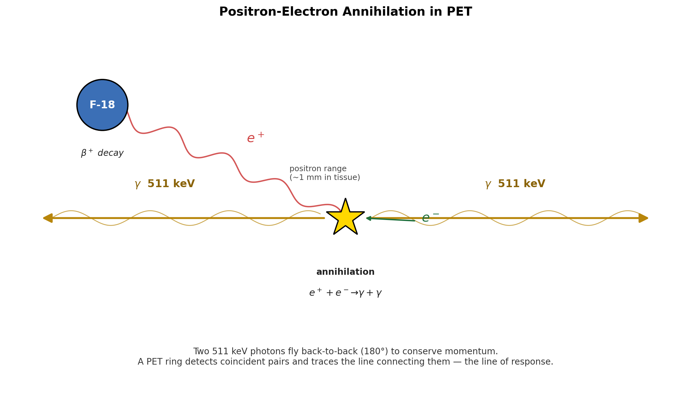
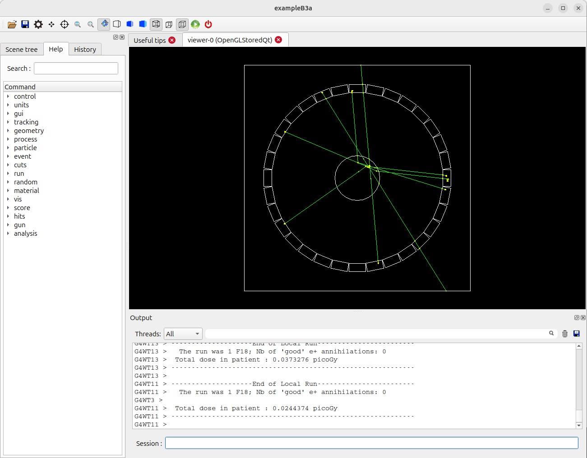
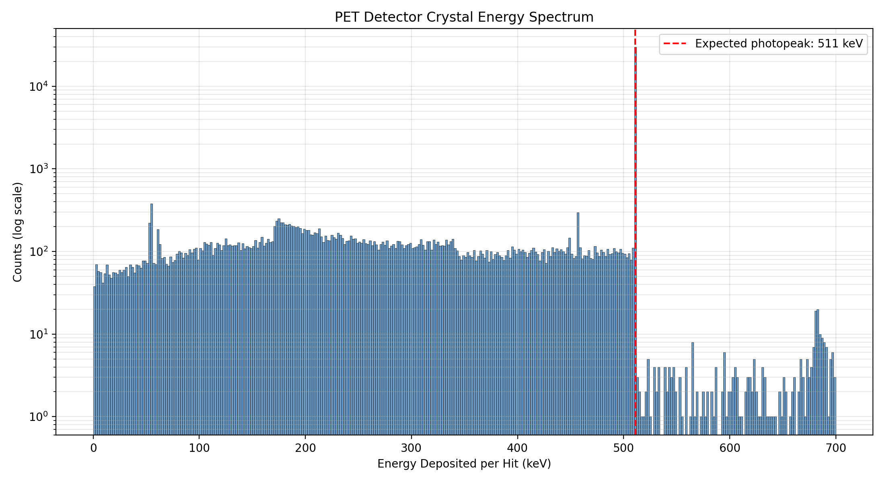
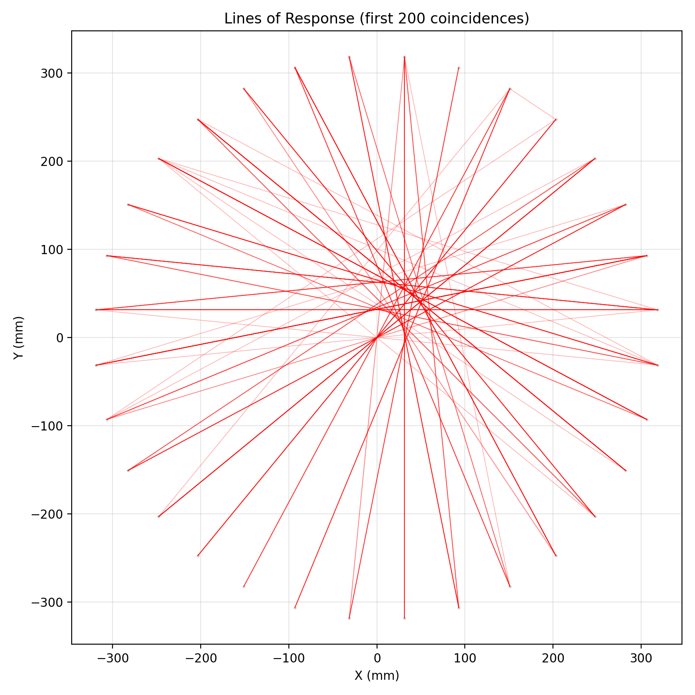

## Learning Objectives

In this final lab, you will apply all the skills you have developed to a more complex and realistic application: a Positron Emission Tomography (PET) scanner. By the end of this session, you will be able to:

- Explain the basic operating principle of a PET scanner
- Compile and visualize a complex multi-volume detector geometry
- Use Geant4's primitive scorer / hits-collection system to record per-crystal energy deposits
- Generate and interpret an energy spectrum from a simulated radiation detector
- Identify a "photopeak" and connect it to the underlying physics
- Reconstruct the spatial arrangement of detector hits and identify coincident events
- Draw "lines of response" connecting coincident hits, the building block of PET image reconstruction

## Introduction

Positron Emission Tomography (PET) is a medical imaging technique used to visualize metabolic processes in the body, especially in oncology. The patient is given a radiotracer such as Fluorine-18 (F-18), a positron-emitting isotope. When an F-18 nucleus decays, it emits a positron. The positron travels a very short distance through tissue before encountering an electron, and the matter–antimatter pair annihilates, converting their rest mass into two gamma-ray photons.



To conserve momentum, the two photons fly off in nearly opposite directions, and each has an energy of 511 keV — the rest mass energy of an electron. A PET scanner is essentially a ring of scintillator detectors designed to detect these photon pairs arriving at almost the same time (in "coincidence"). By recording many such pairs and tracing the line connecting each pair back through the patient, a computer reconstructs an image of where the tracer accumulated.

In this lab, we use **Geant4 Example B3a**, a simplified PET scanner simulation. Our goal is to:

1. Record the energy deposited in each scintillator crystal for every event.
2. Plot an energy spectrum and identify the **511 keV photopeak** — the signature of a gamma ray fully absorbed by a single crystal.
3. Find events with two photopeak hits in coincidence and draw the **lines of response (LOR)** that connect them.

## Prerequisites

- Completed Lab 3 (familiarity with `G4AnalysisManager`, pandas, and matplotlib)
- Basic understanding of beta-plus decay and electron-positron annihilation
- C++ and Python environments configured from previous labs

## Pre-Lab Questions

1. What is positron-electron annihilation, and why does it produce two photons rather than one?
2. What is the energy of each annihilation photon, and why is this specific energy important for PET?
3. In a detector energy spectrum, what does the "photopeak" represent? What is the "Compton continuum"?
4. Why does PET imaging rely on detecting two photons in *coincidence* rather than one at a time?

## Step 1: Set Up and Compile the B3a Example

The B3 example contains two sub-projects, `B3a` and `B3b`. They share geometry and physics, but differ in how event-level statistics are accumulated. We will use `B3a`.

1. Create a lab directory and copy the B3 source tree into it:

   ```bash
   mkdir -p ~/g4-labs/lab4
   cd ~/g4-labs/lab4
   cp -r ~/geant4-v11.3.2/examples/basic/B3 .
   cd B3/B3a
   ```

2. Create a build directory and configure with CMake:

   ```bash
   mkdir build
   cd build
   cmake ..
   ```

3. Compile the application:

   ```bash
   make -j$(nproc)
   ```

   The executable will be named `exampleB3a`.

## Step 2: Visualize the PET Scanner Geometry

Before running a long simulation, look at the detector to understand what we are simulating.

1. Run the application in interactive mode:

   ```bash
   ./exampleB3a
   ```

2. The Qt GUI will open. The geometry is more complex than B1: rings of scintillator crystals surround a central cylinder representing a patient phantom.

   

3. Fire a few events to see particles produced by F-18 decay:

   ```bash
   /run/beamOn 5
   ```

   You should see positron tracks (short, in the phantom) followed by pairs of gamma tracks heading to opposite sides of the ring.

4. Rotate the view to confirm the ring geometry, then exit the GUI:

   ```bash
   exit
   ```

## Step 3: Modify the C++ Code to Record Crystal Hits

B3a already uses Geant4's primitive scorer system. In `DetectorConstruction.cc`, a `G4MultiFunctionalDetector` named **`crystal`** is attached to each crystal volume, with a `G4PSEnergyDeposit` primitive scorer named **`edep`**. There is also a similar scorer for the patient phantom (`patient/dose`).

What you may not realise is that B3a's `exampleB3a.cc` already creates a `G4ScoreNtupleWriter` and calls `SetNtupleMerging(true)` on it. **This means the framework will automatically write a per-event ntuple for each primitive scorer** — including event ID, crystal cell ID, and energy deposit — as soon as we hand it an open output file. We don't have to write our own `EndOfEventAction` loop, define our own ntuple, or fill any rows ourselves.

In modern Geant4, B3a's action classes (`RunAction`, `EventAction`, `ActionInitialization`) live inside `namespace B3a`, and the shared geometry/physics classes live inside `namespace B3`. The header and source files do **not** carry a `B3a` filename prefix. Every code addition you make below will go inside an existing `namespace B3a { ... }` block.

So the entire C++ change in this lab is six new lines in **one file**: tell the analysis manager to use CSV, open an output file in `BeginOfRunAction`, and write/close it in `EndOfRunAction`. That's it.

### Modification: RunAction.cc

1. Open `src/RunAction.cc`:

   ```bash
   gedit src/RunAction.cc &
   ```

2. Add the analysis-manager header at the top, near the other `#include` lines:

   ```cpp
   #include "G4AnalysisManager.hh"
   ```

3. Inside `RunAction::BeginOfRunAction(const G4Run*)`, add at the top of the function body:

   ```cpp
   // --- Lab 4 addition: route the framework's score-ntuple output to CSV
   auto analysisManager = G4AnalysisManager::Instance();
   analysisManager->SetDefaultFileType("csv");
   analysisManager->OpenFile("B3_output");
   ```

4. Inside `RunAction::EndOfRunAction(const G4Run*)`, add at the **very end** of the function:

   ```cpp
   // --- Lab 4 addition: flush and close the CSV
   auto analysisManager = G4AnalysisManager::Instance();
   analysisManager->Write();
   analysisManager->CloseFile();
   ```

That is the only file you need to edit. `EventAction.cc` is left untouched — the framework's `G4ScoreNtupleWriter` fills the ntuples automatically once a file is open.

## Step 4: Compile, Run, and Inspect the Output

1. Re-compile your modified application:

   ```bash
   cd build
   make -j$(nproc)
   ```

   If you encounter errors, double-check brace placement, semicolons, and that your additions are inside the correct function.

2. Create a macro file `lab4.mac` in the `B3a` directory (one level up from `build`):

   ```bash
   cd ..
   nano lab4.mac
   ```

   Add:

   ```
   # Lab 4: PET scanner data run

   # Force single-threaded mode so we get ONE CSV file, not one per worker.
   # Must come BEFORE /run/initialize. (Same trick as Lab 3.)
   /run/numberOfThreads 1

   /run/initialize
   /run/printProgress 5000
   /run/beamOn 50000
   ```

3. Run the simulation in batch mode:

   ```bash
   cd build
   ./exampleB3a ../lab4.mac
   ```

   This will take a few minutes depending on your hardware.

4. Verify the output:

   ```bash
   ls -lh *.csv
   head B3_output_nt_crystal_edep_t0.csv
   ```

   You will see several CSV files. The framework writes one ntuple per primitive scorer:

   - `B3_output_nt_crystal_edep_t0.csv` — **the file we want.** Three columns: `crystal_edep_eventId`, `crystal_edep_cell` (the crystal copy number), and `crystal_edep_score` (the energy deposit in MeV).
   - `B3_output_nt_patient_dose_t0.csv` — patient-phantom dose data. We don't use it in this lab.
   - The same names without the `_t0` suffix are master-thread placeholders containing only headers; you can ignore (or `rm`) them.

   The first line of `B3_output_nt_crystal_edep_t0.csv` after the `#`-prefixed metadata should look like `0,1,0.510999` — event 0, crystal 1, ~511 keV deposited (the photopeak signal we are about to plot).

## Step 5: Plot the Energy Spectrum

Now we switch to Python for analysis. We will plot the distribution of `Edep` across all hits and look for the 511 keV photopeak.

In your `B3a/build` directory, create `analyze_spectrum.py`:

```bash
nano analyze_spectrum.py
```

Paste the following content (must start at column 0 — no leading whitespace):

```python
import pandas as pd
import matplotlib.pyplot as plt

# Geant4's CSV begins with metadata lines starting with '#'. We skip those
# and supply our own column names matching the C++ ntuple definition.
data = pd.read_csv('B3_output_nt_crystal_edep_t0.csv',
                   comment='#', header=None,
                   names=['EventID', 'CrystalID', 'Edep'])
data['Edep_keV'] = data['Edep'] * 1000.0

print(f"Total hits recorded: {len(data)}")
print(f"Unique events with at least one hit: {data['EventID'].nunique()}")
print(f"Mean Edep:   {data['Edep_keV'].mean():.2f} keV")
print(f"Median Edep: {data['Edep_keV'].median():.2f} keV")

plt.figure(figsize=(11, 6))
plt.hist(data['Edep_keV'], bins=350, range=(0, 700),
         color='steelblue', alpha=0.8, edgecolor='black', linewidth=0.3)
plt.axvline(511, color='red', linestyle='--', linewidth=1.5,
            label='Expected photopeak: 511 keV')

plt.title('PET Detector Crystal Energy Spectrum')
plt.xlabel('Energy Deposited per Hit (keV)')
plt.ylabel('Counts (log scale)')
plt.yscale('log')
plt.legend()
plt.grid(True, alpha=0.3, which='both')
plt.tight_layout()
plt.savefig('pet_spectrum.png', dpi=200)
print("Spectrum saved to pet_spectrum.png")
```

Run it:

```bash
python3 analyze_spectrum.py
eog pet_spectrum.png
```

You should see a sharp peak near 511 keV (the photopeak) sitting on top of a broader, lower-energy distribution (the Compton continuum).



## Step 6: Coincidence Analysis and Lines of Response

A single 511 keV hit tells us nothing about *where* the positron decayed. The PET imaging signal comes from **coincidence**: two photopeak hits, in the same event, on opposite sides of the detector ring. The line connecting the two hit crystals — the **line of response (LOR)** — passes through the decay point.

We did not record (x, y) directly in the C++ code, but we recorded the crystal copy number, which is enough: B3a's crystals are arranged in a regular ring, so we can compute each crystal's position from its copy number. The default geometry in `DetectorConstruction.cc` lays out:

- **32 crystals per ring**, evenly spaced around 360°
- **9 axial rings** stacked along the scanner's z-axis
- Crystals are placed at a fixed inner radius (≈ 32 cm; see the constructor for the exact value)

Copy numbers run sequentially: copy `n` belongs to ring `n // 32`, position `n % 32` within that ring.

Create `analyze_coincidence.py` in the `build` directory:

```bash
nano analyze_coincidence.py
```

Paste the following content (must start at column 0 — no leading whitespace):

```python
import pandas as pd
import matplotlib.pyplot as plt
import numpy as np

# --- B3a default geometry constants ---
# If you have changed the detector, update these to match.
N_CRYST_PER_RING = 32
N_RINGS = 9
RING_RADIUS_MM = 320.0   # approximate; verify in DetectorConstruction.cc
AXIAL_PITCH_MM = 30.0    # approximate ring-to-ring spacing


def crystal_position(crystal_id):
    """Map a B3a crystal copy number to its approximate (x, y, z) center, in mm."""
    ring_idx = crystal_id // N_CRYST_PER_RING
    in_ring = crystal_id % N_CRYST_PER_RING
    theta = (in_ring + 0.5) * 2.0 * np.pi / N_CRYST_PER_RING
    x = RING_RADIUS_MM * np.cos(theta)
    y = RING_RADIUS_MM * np.sin(theta)
    z = (ring_idx - (N_RINGS - 1) / 2.0) * AXIAL_PITCH_MM
    return x, y, z


# --- Load data and add positions ---
data = pd.read_csv('B3_output_nt_crystal_edep_t0.csv',
                   comment='#', header=None,
                   names=['EventID', 'CrystalID', 'Edep'])
data['Edep_keV'] = data['Edep'] * 1000.0
xyz = data['CrystalID'].apply(crystal_position)
data['X'] = xyz.apply(lambda t: t[0])
data['Y'] = xyz.apply(lambda t: t[1])
data['Z'] = xyz.apply(lambda t: t[2])

# --- Hit-position scatter (top view) ---
plt.figure(figsize=(7, 7))
plt.scatter(data['X'], data['Y'], s=2, alpha=0.1)
plt.title('Crystal Hit Positions (Top View)')
plt.xlabel('X (mm)')
plt.ylabel('Y (mm)')
plt.axis('equal')
plt.grid(True, alpha=0.3)
plt.tight_layout()
plt.savefig('hit_positions.png', dpi=200)

# --- Filter for photopeak hits ---
PHOTOPEAK_LOW = 450   # keV
PHOTOPEAK_HIGH = 550  # keV
photopeak = data[(data['Edep_keV'] >= PHOTOPEAK_LOW) &
                 (data['Edep_keV'] <= PHOTOPEAK_HIGH)]
print(f"Hits in photopeak window [{PHOTOPEAK_LOW}, {PHOTOPEAK_HIGH}] keV: "
      f"{len(photopeak)} ({100*len(photopeak)/len(data):.1f}% of all hits)")

# --- Find true coincidences: events with exactly 2 photopeak hits ---
counts_per_event = photopeak.groupby('EventID').size()
coincidence_events = counts_per_event[counts_per_event == 2].index
print(f"Total events processed: {data['EventID'].nunique()}")
print(f"True coincidences found: {len(coincidence_events)}")

coincident_hits = photopeak[photopeak['EventID'].isin(coincidence_events)]

# --- Draw lines of response ---
plt.figure(figsize=(8, 8))
plt.scatter(data['X'], data['Y'], c='lightgray', s=1, alpha=0.1,
            label='all hits')

plotted = 0
max_lines = 200
for event_id in coincidence_events:
    if plotted >= max_lines:
        break
    pair = coincident_hits[coincident_hits['EventID'] == event_id]
    plt.plot(pair['X'].values, pair['Y'].values,
             'r-', alpha=0.3, linewidth=0.6)
    plotted += 1

plt.title(f'Lines of Response (first {plotted} coincidences)')
plt.xlabel('X (mm)')
plt.ylabel('Y (mm)')
plt.axis('equal')
plt.grid(True, alpha=0.3)
plt.tight_layout()
plt.savefig('lines_of_response.png', dpi=200)
print("LOR figure saved to lines_of_response.png")
```

Run it:

```bash
python3 analyze_coincidence.py
eog lines_of_response.png
```

You should see a dense cluster of red lines crossing near the center of the ring — that intersection region marks the location of the simulated source.



## Analysis Questions

### Energy Spectrum

1. Open `pet_spectrum.png`. At what energy is the main peak centered? How close is this to the theoretical 511 keV?
2. Why is the photopeak so much taller than the rest of the spectrum?
3. The broad, lower-energy distribution is the **Compton continuum** — gamma rays that scattered inside a crystal and escaped, depositing only part of their energy. Why is it important for a PET scanner to distinguish photopeak hits from Compton-continuum hits?

### Coincidence Logic

4. We defined a true coincidence as "exactly two hits in the photopeak window in the same event." What might cause an event to have *three* photopeak hits? What about *one*?
5. We used a tight window of 450–550 keV. What would happen to the fraction of accepted events — and to the spatial accuracy of the LORs — if we widened the window to 200–700 keV? (Hint: think about Compton-scattered photons from one crystal landing in another.)

### Lines of Response

6. Look at `lines_of_response.png`. Do the lines all cross at a single point, or is there a spread? What physical effects limit the spatial resolution of a real PET scanner? (Consider: positron range before annihilation, non-collinearity of the two photons, finite crystal size.)
7. Where in the image is the densest crossing region? What does this tell you about where the simulated source is located?

### Workflow

8. We used the existing primitive scorer rather than writing a custom sensitive detector. What did this save us, and what did we give up (e.g., what information about the hit was *not* available)?
9. How would you extend the simulation to image two separate point sources in the phantom? What changes in the C++? What changes in the Python?

## Troubleshooting

- **Compilation errors mentioning `G4AnalysisManager`**: make sure you added `#include "G4AnalysisManager.hh"` to `RunAction.cc`.
- **CSV file not found in Python**: confirm the filename in `pd.read_csv(...)` matches what `ls *.csv` shows in your `build` directory.
- **No photopeak in the spectrum**: check that you ran enough events (50,000 is a reasonable minimum) and that you are reading the file in keV. Also check the histogram range and binning.
- **Many `B3_output_nt_crystal_edep_tN.csv` files instead of one `_t0.csv`**: Geant4 ran multi-threaded. Add `/run/numberOfThreads 1` to your macro **before** `/run/initialize`, delete the per-thread files (`rm B3_output_nt_*_t*.csv`), and re-run.
- **Empty LOR figure**: tighten or relax the photopeak window. With very few simulated events, you may need to lower the lower bound (e.g., 400 keV) to find any coincidences.

## Verification Checklist

Before completing this lab, verify you can:

- [ ] Compile and run the unmodified B3a example
- [ ] Identify the existing `crystal/edep` hits collection in the source code
- [ ] Modify `RunAction.cc` to route the framework's score ntuples to CSV
- [ ] Generate `B3_output_nt_crystal_edep_t0.csv` from a 50,000-event run
- [ ] Plot the crystal energy spectrum and identify the 511 keV photopeak
- [ ] Map crystal copy numbers to (x, y) positions
- [ ] Find true-coincidence events and draw their lines of response

## Conclusion

In this lab you simulated a complete PET scanner system. You navigated B3a's existing primitive-scorer infrastructure, added per-hit data output, and used Python to extract two pieces of physics from the same dataset: the **511 keV photopeak** in the energy spectrum, and the **lines of response** that connect coincident annihilation photons. Together these are the building blocks of PET image reconstruction — combining particle physics (annihilation), detector hardware (scintillators), and software (coincidence logic) to see inside the body.

## References

- Geant4 Collaboration. (n.d.). *README for examples/basic/B3*. GitLab.
- Geant4 Collaboration. (n.d.). *Geant4 Application Developer's Guide — Hits and Sensitive Detectors*.
- Cherry, S. R., Sorenson, J. A., & Phelps, M. E. (2012). *Physics in Nuclear Medicine* (4th ed.). Elsevier Health Sciences.

## Optional Extensions

1. **Energy resolution.** Real scintillators broaden the photopeak. Add Gaussian smearing of `Edep` in your Python analysis (e.g., 10% FWHM at 511 keV) and re-run the spectrum and coincidence steps.
2. **3-D LORs.** Use the `Z` column from `crystal_position` to draw lines of response in 3-D with `mpl_toolkits.mplot3d`.
3. **Two sources.** Modify the primary generator to alternate between two source positions, then check whether your LOR plot shows two overlapping clusters of crossings.
4. **Custom sensitive detector.** Replace the primitive scorer with a custom `G4VSensitiveDetector` and a `CrystalHit` class (in `namespace B3a`) that records position and time directly in C++. Compare the results to the copy-number-based approach used here.
